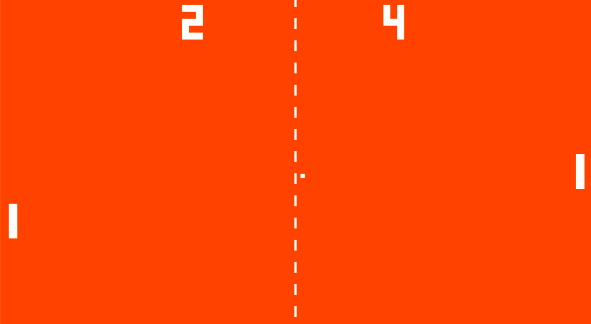

<h1 align="center">Pong</h1>

  

        

Yep, this is yet another Pong game. The only difference with this clone is that this one has sound effects, and a CPU to play against! You can play with a friend, or play against the AI. I've never actually written a Pong game before, so I figured I would use my C-Standards library to do so.

## Dependencies

The only dependencies for this library are SDL components, and the C-Standards library.

1. [SDL_2.0.12](https://www.libsdl.org/download-2.0.php)
2. [SDL_ttf 2.0.15 (Fonts)](https://www.libsdl.org/projects/SDL_ttf/)
3. [SDL_mixer 2.0.4 (Audio)](https://www.libsdl.org/projects/SDL_mixer/)
4. [SDL_image 2.0.5 (PNG/JPG Wrapper)](https://www.libsdl.org/projects/SDL_image/)
5. [C-Standards](https://github.com/JoshuaCrotts/C-Standards.git)

## Rebuilding Pong

**Windows**: To rebuild the code, clone the repository to your computer. This project is compiled with MinGW and a makefile. Depending on how you want to compile the project (e.g. with Visual Studio, CodeBlocks, etc.), you may need to alter the makefile to suit your needs. Downloading and installing the dependencies on Windows takes a little more effort than MacOS or Linux:
1. Download [mingw-get-setup.exe](https://osdn.net/projects/mingw/releases/).
2. Install all packages except mingw32-gcc-ada-base, mingw32-gcc-fortran-base, and mingw32-gcc-objc-base through the installer.
3. Download the four libraries above. The SDL2.0.12 link only provides a DLL file. The rest come in a .tar.gz file to extract. Make sure to choose the MinGW developer version.
4. Inside these archives exists two folders: an i686-w64, and x86_64-w64 version. Choose the former (i686-w64). This is the 32-bit version, which is what we will use.
5. There are three folders in each extension: bin, include, and lib. The bin/ folder provides the .dll files. Store these in C:/MinGW/bin. The include/ folder has an SDL2 folder with the respective .h file. Drag the SDL2 folder into C:/MinGW/include (do not take the .h file out!). Lastly, the lib/ folder contains necessary libraries (.a files) that accompany the addon. Drag these into C:/MinGW/lib.
6. At this point, your code should be good to go. If you are using VSCode, make sure to set the compiler to gcc-x86, and set the compiler path to C:/MinGW/bin/gcc.exe. Compile the code via mingw32-make.

**MacOS**: For MacOS, run the following commands in your terminal to get the appropriate development files for SDL:

1. <code>brew install SDL2</code>
2. <code>brew install SDL2_image</code>
3. <code>brew install SDL2_ttf</code>
4. <code>brew install SDL2_mixer</code>

Then, compile via <code>make</code>.

**Linux (Ubuntu/Debian)**: The process is similar to the former, with the exception of having to install SDL files to your system in Linux. Run the following commands (or their distro-equivalent) in your terminal:

1. <code>sudo apt-get install libsdl2-dev</code>
2. <code>sudo apt-get install libsdl2-image-dev</code>
3. <code>sudo apt-get install libsdl2-ttf-dev</code>
4. <code>sudo apt-get install libsdl2-mixer-dev</code>

Then, compile via <code>make</code>.

**Linux (Arch-Based Distros)**: Run the following commands after cloning the repo to install SDL2:

1. <code>sudo pacman -S sdl2</code>
2. <code>sudo pacman -S sdl2_image</code>
3. <code>sudo pacman -S sdl2_ttf</code>
4. <code>sudo pacman -S sdl2_mixer</code>

Then, compile via <code>make</code>.

**In all cases**, make sure you download the C-Standards library from the link above. Only the src, include, and lib folders are necessary. Place them into a directory in the root of the project called "/lib/stds/".

## Reporting Bugs

See the Issues Tab.

## Version History
The **master** branch encompasses all changes.
